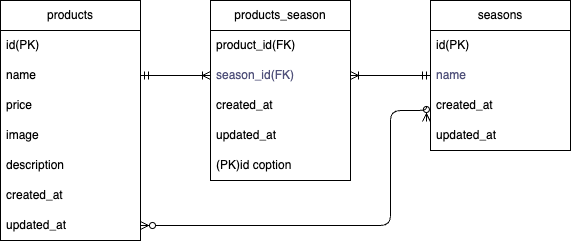

# SecondTestMogitate(確認テスト_もぎたて)

## 環境構築

以下の手順に従って、開発環境をセットアップしてください。

### 1. リポジトリのクローン
```bash
git clone git@github.com:akanemomo/SecondTestMogitate.git
cd SecondTestMogitate
```

### 2. Docker コンテナのビルドと起動
Docker がインストールされていることを確認してください。
```bash
docker-compose up -d --build
```

### 3. Composer のインストール
```bash
docker-compose exec app composer install
```

### 4. 環境設定ファイルの作成
`.env.example` をコピーして `.env` ファイルを作成します。
```bash
cp .env.example .env
```

### 5. 環境変数(.env)
以下の環境変数を `.env` に記載してください。
```dotenv
DB_CONNECTION=mysql
DB_HOST=mysql
DB_PORT=3306
DB_DATABASE=laravel_db
DB_USERNAME=laravel_user
DB_PASSWORD=laravel_pass
```

### 6. アプリケーションキーの生成
```bash
docker-compose exec app php artisan key:generate
```

### 7. マイグレーションの実行
```bash
docker-compose exec app php artisan migrate
```

### 8. シーディング（ダミーデータ投入）
```bash
docker-compose exec app php artisan db:seed
```

## 使用技術(実行環境)

- **言語**: PHP 8.x
- **フレームワーク**: Laravel 9.x
- **データベース**: MySQL
- **コンテナ化**: Docker, Docker Compose
- **フロントエンド**: Blade テンプレート, CSS

## MySQL 設定 (docker-compose.yml)
```yaml
mysql:
  platform: linux/x86_64
  image: mysql:8.0.26
  environment:
    MYSQL_ROOT_PASSWORD: root
    MYSQL_DATABASE: laravel_db
    MYSQL_USER: laravel_user
    MYSQL_PASSWORD: laravel_pass
```

## ER 図



## URL

- **開発環境**: [http://localhost:8000](http://localhost:8000)
